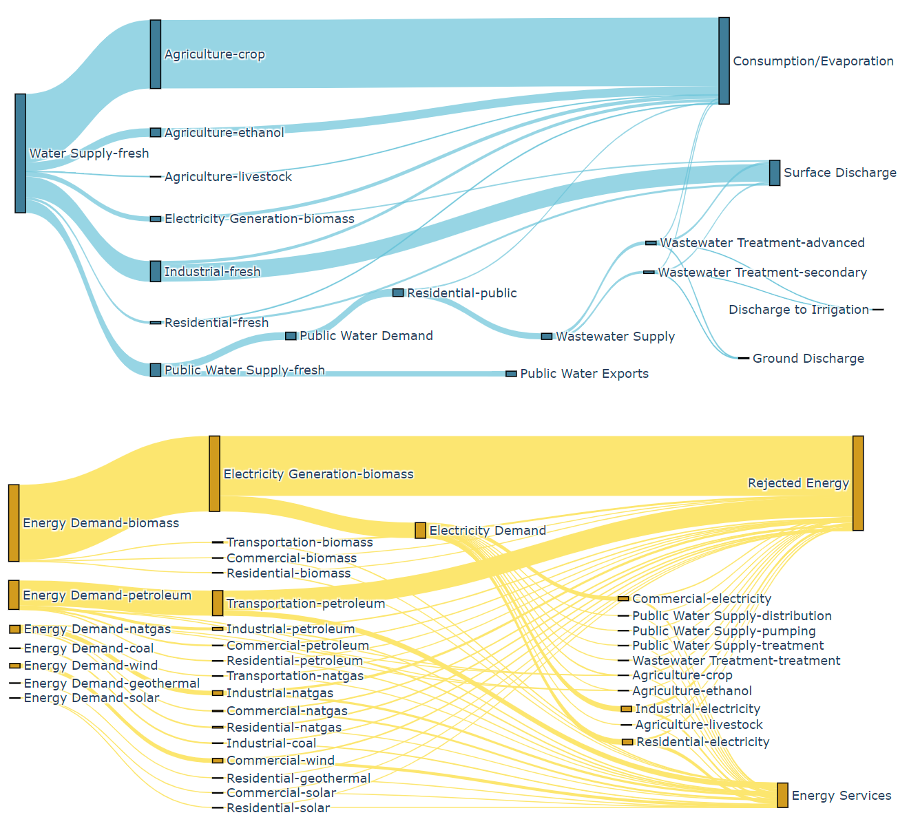
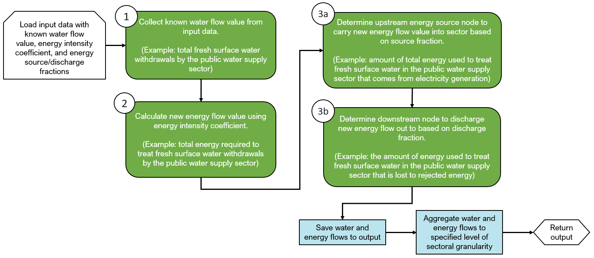

# Summary

Many economic sectors rely on an uninterrupted “upstream” supply of a resource to conduct their primary functions, leaving them vulnerable to adverse effects should that resource flow be interrupted or compromised [@epa2010; @oecd2017]. Well-known examples of these relationships include water demand by the energy sector (e.g., thermoelectric cooling for nuclear generation) [@webber2017; @grubert2018] and energy demand by the water sector (e.g., electricity required to treat or move water in the public water sector) [@copeland2017] though many others exist. Being able to calculate and document these interdependencies and evaluate where the greatest cross-sectoral intensities and flows exist can reveal opportunities to enhance the overall network. Despite the implications and potential impacts, however, these interconnections and flows have been historically complex to analyze and understand.

The `interflow` package provides a flexible tool to organize, calculate, and visualize (using Sankey diagrams and other visualizations) sectoral interdependency flows for multiple subsectors and resources (Figure 1).  This tool can help decision-makers, researchers, and other audiences more easily pull meaning from these interdependencies to reveal multi-faceted opportunities and risks. `interflow` can help investigate questions such as (1) which sectors have high cross-resource dependencies, (2) how does demand for a resource in various sectors compare across regions, and (3) where the sectoral and regional opportunities are for enhanced efficiency, security, and resiliency.

# Statement of Need

The ability to calculate and organize sectoral interdependency data and evaluate where the greatest cross-sectoral intensities and flows exist can enhance network resilience and understanding across both sectors and regions. Historically, however, sectoral interdependency data can be difficult to find and complex to analyze, understand, and utilize. There is also significant variance in the availability of comprehensive and reproducible data sets, making it more difficult to build on prior research and make new advances. An open-source framework that can generate, organize, and visualize multisectoral interdependency data in a replicable manner would be advantageous to several audiences. This list can include researchers in energy, climate, water, agriculture, or other areas studying sectoral interactions as well as policymakers and regulators seeking information to better inform their decision-making. A generalizable tool that can identify where the interdependencies between sectors are, what their relative scale is, and how they compare across regions would contribute to advancement in several analytical spaces.

# State of the Field

To the best of our knowledge, there is no open-source software option available that facilitates the calculation, organization, and visualization of multiscale, multisector interdependencies in one place. Software exists for visualizing pre-calculated sectoral flow values as Sankey diagrams such as e!Sankey [@esankey2022], SDraw [@sdraw2022], SankeyBuilder [@sankeybuilder2022], SankeyMATIC [@sankeymatic2022], or the Python library matplotlib [@hunter2007], but these tools do not offer a way to calculate the demand of a cross-resource type and build out new sectoral connections based on the result. While the proprietary options in the above list (e!Sankey, SDraw, and SankeyBuilder) allow for complex customizability in diagram formatting and, in the case of e!Sankey, can also calculate input and output flow balances by node, none of the options listed (proprietary or open-source) offer a cross-unit computation capability. The interflow package aims to fill this gap and serve as a flexible and open-source option for conducting multi-resource sectoral interdependency data calculations, producing multisectoral datasets, and visualizing the results.

Sectoral interdependency analysis itself is not a new area of research [@curmi2013; @liu2016; @greenberg2017], but the publications in this area typically return only the end-product of their analysis (e.g., output values or diagrams). The detailed methodology or algorithms developed to conduct their calculations are often not provided in an accessible or transparent manner. Researchers looking to build upon or modify the existing assumptions and data are left to redevelop the calculation structure from scratch as a result. The `interflow` package provides a consistent and open-source calculation framework to enable reproducibility.

# Design and Methodology

The `interflow` package iterates through a user-provided tabular input data to (1) collect known resource flow values (e.g., water demand) between provided sectors, (2) calculate new sector flow values for a secondary resource type from the initial flow (e.g., energy demand based on the water flow) using provided cross-resource intensity coefficients, and (3) build upstream and downstream sector connections to carry those calculated and collected flows. Collected and calculated flows are then compiled in a way that can be used in a variety of data visualization functions offered in the package. Figure 2 provides a simple illustrative example of how `interflow` calculates an energy flow based on a known water flow between the water supply and the public water supply sector, following each step described.

The basic methodology described above is repeated for all regions provided by the user in the input data. Though the `interflow` package comes equipped with extensive sample data to evaluate U.S. county-level water and energy flows across various sectors, it can conduct analysis for any region (e.g., country, province), any sector or group of sectors (e.g., electricity generation, agriculture), and any group of resources (e.g., water, energy, food, carbon, land) and is limited only by the input data that the user provides. More information on the input data requirements can be found in the [generalizability documentation](https://pnnl.github.io/interflow/user_guide.html#generalizability). All code used to generate the sample water and energy input data for all US counties is additionally included as part of the package.

A Pandas DataFrame [@mckinney2010] containing collected and calculated flow values between sectors for each region and resource type is returned as output from the `calculate()` function. The DataFrame output can be directly used with other package functions to generate a variety of visualizations which each utilize the Plotly Python package [@plotly2015] including (1) Sankey diagrams showing the network of flows across sectors for a chosen region, (2) stacked bar charts of inflow and outflow values for sectors in a region, and (3) a choropleth map to compare flow values across regions. The visualizations can be used to compare dependencies across and between sectors at various levels of sub-sector granularity. Given that `interflow` collects and calculates values for each region provided in the input data, the output can additionally be used for region-wise comparisons of flows and intensities. For more information on the key outputs see the [outputs documentation](https://pnnl.github.io/interflow/user_guide.html#key-outputs).

# Acknowledgements

This research was supported by the U.S. Department of Energy, Water Power Technologies Office, as part of research in Integrated Water Power Resilience.

# References
